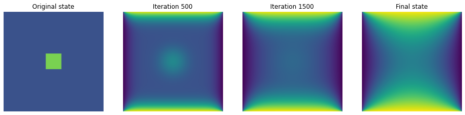

Capstone Project: Gauss Seidel Parallel Programming with Cuda
------------------------------------------------------------------------------------------------------------------------
https://github.com/khanhtq2101/ParallelDiffusionSimulation.git  
Implementing Gauss Seidel algorithm by parallel programming with cuda and demo visualization.

How to evaluate?  
------------------------------------------------------------------------------------------------------------------------
1. Clone the repo: https://github.com/khanhtq2101/ParallelDiffusionSimulation.git
2. cd to the cloned directory
3. Create result folder:  
```
   mkdir -p ./results/CUDA
```
4. Compile the GaussSeidel.cu file, the output will automatically save on above /results/CUDA folder: 
``` 
   nvcc -o GaussSeidel_CUDA GaussSeidel.cu  
   ./GaussSeidel_CUDA
```
5. Run file text_to_imgage.py file to convert result in text to image.  
```
   python text_to_image.py 
```
6. Run file display.py if you want to display process in some iterations.
```
   python display.py
```
=> The result is an image automatically saved in /resuls/images as following  

7. Run file create_gif.py to create gif for diffusion process.  
```
   python create_gif.py 
```
=> This will create a gif file for process visulisation in /results/images.  
* Top down visulization: Initialization: 80 at centers and 25 around. Boundary condition: 100 at top right and 0 at bottom left.  

* Top right visualization: Initialization: 80 at centers and 25 around.
Boundary condition: 100 at top down, and 0 at left and right side.  


